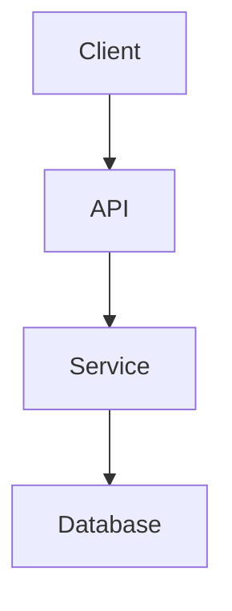

# Skill: architecture

## Purpose

`architecture` captures and communicates architectural decisions clearly.

It prevents:

- Undocumented design choices that confuse future developers.
- "Why did we do it this way?" mysteries.
- Architecture drift without conscious decision tracking.
- Poor system understanding during onboarding.

Instead, it:

- Records decisions with context and rationale.
- Creates architecture overviews from code analysis.
- Produces ADR (Architecture Decision Record) documents.
- Generates text-based diagrams for system visualization.

This skill should be invoked when planning new features, making design decisions, or documenting existing architecture.

---

## Invocation

### Explicit

```text
/architecture
/architecture --type=adr
/architecture --type=overview --depth=2
/architecture "Add caching layer" --plan
```

### Natural Language Triggers

If the user says things like:
- "Document the architecture."
- "What's the system design?"
- "Why was this chosen?"
- "Create an ADR."
- "Map out the system."
- "What's the high-level structure?"
- "Plan the architecture for..."

You MUST treat it as an architecture invocation.

---

## Arguments

All optional:

- `--type=adr|overview|diagram|full`
  - adr → Architecture Decision Record for a specific decision.
  - overview → High-level system architecture summary.
  - diagram → Text-based architecture diagram.
  - full → All of the above.
  - Default: overview.
- `--depth=1|2|3|4`
  - 1 → High-level modules only.
  - 2 → Include key components and interactions (default).
  - 3 → Include data flows and dependencies.
  - 4 → Full detail including protocols, configs, edge cases.
- `--decision=<topic>` — Specific decision to document (for ADR type).
- `--output=<path>` — Where to write documentation. Default: stdout.
- `--format=markdown|json|text` — Output format. Default: markdown.

---

## Behavior

When architecture is invoked, you MUST:

1. **Assess the project state**
   - Identify project type (API, CLI, web app, library, etc.).
   - Detect language, framework, and key dependencies.
   - Identify main entry points and modules.

2. **For `--type=overview`:**
   - Identify major components (frontend, backend, services, DB, etc.).
   - Map module boundaries and dependencies.
   - Note configuration and environment handling.
   - Identify data flows (how requests travel through the system).

3. **For `--type=adr`:**
   - If `--decision` provided: document that specific decision.
   - If not: identify recent or significant decisions from conversation.
   - Include: title, status, context, decision, consequences, alternatives considered.

4. **For `--type=diagram`:**
   - Generate text-based diagram (Mermaid, ASCII, or structured text).
   - Show components, relationships, and data flows.
   - Use appropriate diagram type (flowchart for processes, sequence for interactions, C4 for system).

5. **Output the result**
   - Print in chat or write to `--output` path.
   - Use the Output Structure below.

---

## Output Structure

### For ADR:

```markdown
# ADR: <Decision Title>

**Date:** <YYYY-MM-DD>

**Status:** Proposed | Accepted | Deprecated | Superseded

## Context
<What is the issue motivating this decision?>

## Decision
<What is the change being proposed/decided?>

## Consequences
<What becomes easier or harder to do because of this?>

## Alternatives Considered
- <Alternative 1>: <why rejected>
- <Alternative 2>: <why rejected>
```

### For Overview:

```markdown
# Architecture Overview

## System Type
<e.g., REST API, SPA, CLI tool, library>

## High-Level Components
| Component | Responsibility | Location |
|-----------|----------------|----------|
| <name>    | <what it does> | <path>   |

## Data Flow
<How data moves through the system>

## Dependencies
<Key external dependencies and their roles>

## Configuration
<Environment variables, config files>

## Deployment
<How and where the system runs>
```

### For Diagram:



Or ASCII if Mermaid not supported.

---

## Constraints and Guarantees

- Document what exists, not what should exist (unless `--plan` mode).
- Include rationale for decisions, not just outcomes.
- If architecture is unclear, state "Unable to determine" rather than guess.
- Keep ADRs focused on one decision each.
- The output MUST be self-contained and understandable by a new developer.

---

## Philosophy

Architecture is a shared understanding.

architecture ensures that understanding is written down, so every developer — including future-you — can onboard quickly and make informed decisions.

---
